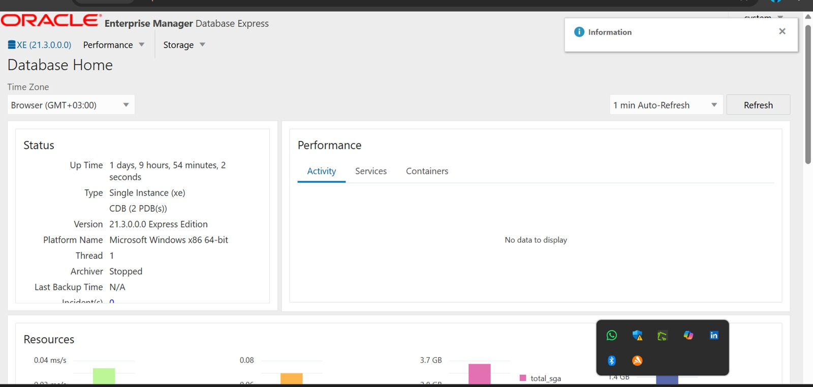

## Names: UMUTONI Uwase Sonia
## ID:28352
## Department: Software Engineering
## Courses: Database development with PL/SQL(INSY 8311)
## Instructor: Eric MANIRAGUHA
## Date: 07/10/2025
## PROJECT TOPIC: PL/SQL(PDBS)

## ALL TASKS: Create new PDBS,CREATE AND DELETE PDB,CREATE ORACLE 

### Task 1: Create New PDB

First of all  I check for verfying and demonstrating  the PDB I alredy have in oracle

Then ,Creation of NEW PDB  by following given instructions from  task,like to rename it by using my first names(sonia)and identified by my ID(28352)
  AS it displayed PDB is created.

here we display a table of given PDB we have in our oracle , and that one also included in table .and table differ from other before

### TASK 2:  I CREATE ANOTHER PDB BY FOLLOWING INSTRUCTION of using the 2 begining letter of my name and identified by ID

 IT already created as it was displayed started by two letter of my first name

THEN This Image  displays the deletion of   the table with inserted new PDB with followed instructions

Then dropping  created PDB among others and even in tables

deletion success full

### TASK 3: CONFIGURATION OF  ORACLE ENTERPRISE MANAGER(OMF)

THIS IMAGE DISPLAYS THE DASHBOARD AFTER  ORACLE ENTERPRISE MANAGEMENT  CONFIGURATIONS

